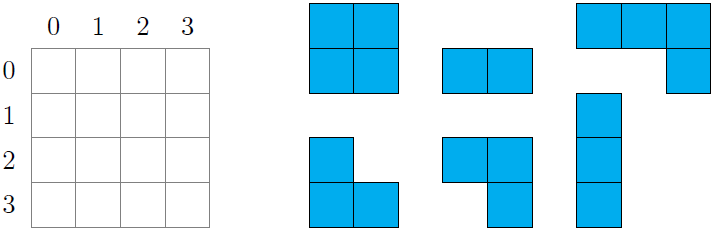
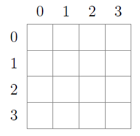
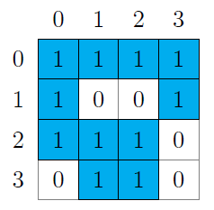
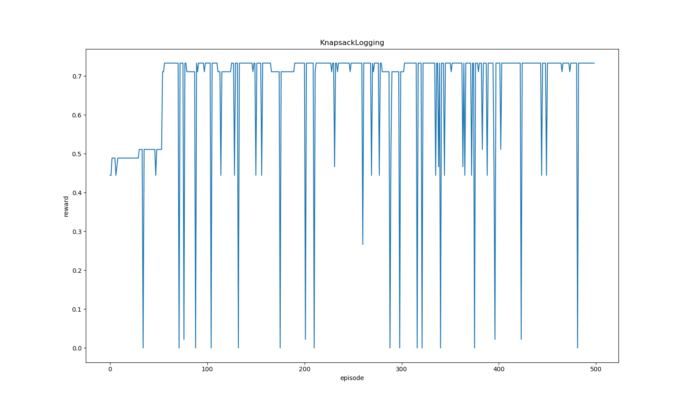
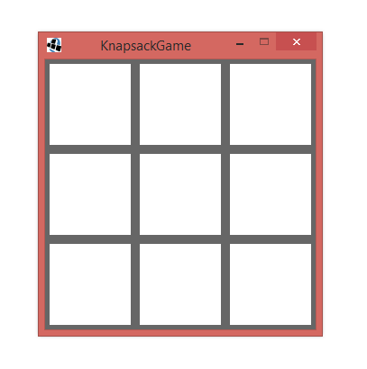
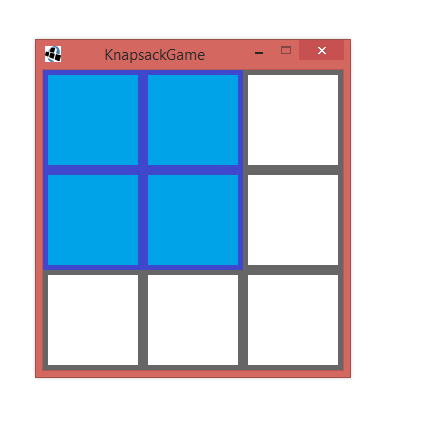
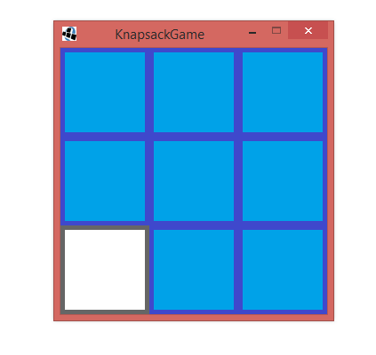
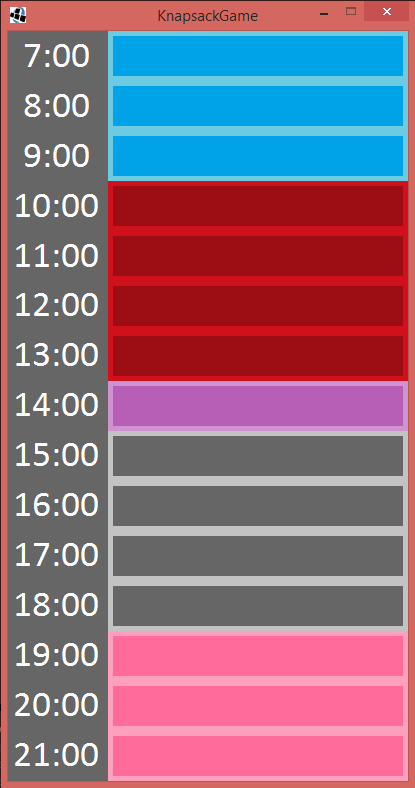
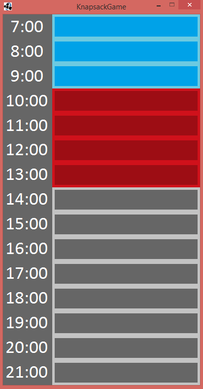
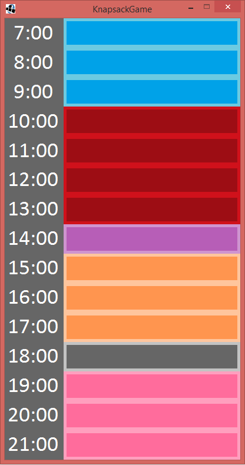

# Das Problem

Als Abwandlung des Rucksack-Problems wird ein rechteckiges Spielfeld der Größe (n, m) aufgestellt. Es gilt, auf diesem Spielfeld eine vordefinierte Menge von Spielsteinen zu platzieren, sodass die Spielsteine sich nicht überlappen oder über den Rand des Spielfeldes hinaus ragen. 

Ferner wird jedem Spielstein ein Wert zugeordnet, der modelliert wie wichtig es ist, dass der betreffende Spielstein auf das Spielfeld gesetzt wird.

Mit Hilfe dieses Grundgerüstes lassen sich dann einige speziellere Probleme lösen.

* Mit einem (n, 1)-Spielfeld und ausschließlich Spielsteinen der Größe (x, 1) lässt sich das Rucksack-Problem direkt modellieren.
* Mit einem (30, 10)-Spielfeld und der Möglichkeit Spielsteine zu rotieren, lässt sich eine Form von Tetris modellieren. (Die Werte der Spielsteine werden dabei ignoriert)
* Mit einem (1, m)-Spielfeld kann ein einfacher Scheduler programmiert werden, der höher-priore Aufgaben früher ausführt als niedrig-priore.

Der Agent soll erlernen, welche Steine er wo auf dem Spielfeld platzieren muss, um eine möglichst große Zahl von wertvollen Spielsteinen auf dem Feld liegen zu haben und das Feld so gut wie möglich zu füllen.

# Modellierung

## Agent, Umgebung und Zustandsraum

Bei unserem Agenten handelt es sich um den Spieler, der eine vorgegebene Menge von Spielsteinen gemäß der Regeln auf das Spielfeld setzt.
Die Umgebung des Agenten wird also durch das Spielfeld definiert, auf welchem sich stellenweise bereits Spielsteine befinden können.

Der Zustandsraum spannt sich damit in alle möglichen Zustände des Spielfeldes auf - also das Aussehen des Spielfeldes zu einem beliebigen Zeitpunkt, wenn alle vorhergehenden Spielzüge korrekt waren. Im schlechtesten Fall (es gibt beliebig viele Spielsteine der Höhe und Breite 1) gibt es also für ein Spielfeld der Größe (n,m) 2^(n x m) Zustände.
Da die Zahl der Zustände damit schnell explodiert, lohnt es sich nicht, für jeden Zustand ein kompliziertes Objekt anzulegen, welches das Aussehen des Spielfeldes speichert. 
Darum werden die Zustände intern als natürliche Zahlen gespeichert, wobei wie in folgender Abbildung vorgegangen wird:

Das Feld wird von links oben nach rechts unten durchlaufen. Wird die aktuell betrachtete Stelle von einem Spielstein verdeckt (hier blau gezeichnet), so setzen wir das niederwertigste Bit der Spielfeld-Repräsentation auf 1 und shiften um eine Stelle nach links. Andernfalls setzen wir das niederwertigste Bit auf 0 und shiften ebenfalls um eine Stelle nach links.
Die Größe des Zustandsraumes wurde dadurch nicht verringert, wohl aber die Anzahl an Bits, die zur Speicherung des Zustandes notwendig sind.

## Aktionen

Der Agent hat die Möglichkeit, einen beliebigen Spielstein aus der Menge der möglichen Spielsteine auszuwählen und auf eine beliebige Position im Feld zu setzen.
Er hat auch die Möglichkeit, ungültige Spielzüge durchzuführen (etwa Überlappung zweier Spielsteine oder Überragen eines Spielsteines über das Feld hinaus), muss also lernen, welche Spielzüge legal sind und welche Spielsteine er wo platzieren muss, um die optimale Lösung zu erhalten.
Die Menge der möglichen Spielsteine wird vor Programmbeginn vom Nutzer festgelegt und kann während der Laufzeit variiert werden (Variation nicht implementiert).

## Belohnungsfunktion

Die Belohnung für den Agenten wird aus der Größe des gesetzten Spielsteins (also wie viele Felder von ihm verdeckt werden) und dem Wert des gesetzten Spielsteins gerechnet.
Konkret erhält der Agent den folgenden Reward: (Anzahl der durch den letzten Zug verdeckten Felder)/(Gesamtanzahl der Felder) * (Wert des gesetzten Spielsteins)/(Maximal auftretender Wert der Spielsteine)
Mit Hinblick auf die implementierte Kalenderfunktion entspricht dieser Reward einerseits dem Wunsch des Nutzers, hochpriore Aufgaben definitiv auf den Terminplan zu setzen (und dafür niederpriore Aufgaben zu ignorieren, wenn der Terminkalender bereits voll ist) und andererseits eine möglichst große Fläche des Terminkalenders zu füllen.

# Algorithmen und initiale Simulation

Um unseren Agenten lernen zu lassen entschieden wir uns für Q-Learning, da die ihn umgebende Welt stark an die GridWorld erinnert.
Eine plausible Alternative wäre SARSA(lambda) gewesen, birgt aber die große Gefahr, dass sich der Agent auf Grund der Eligibility Traces auf eine Lösung versteift, die unter der ersten Betrachtung gut ist (beispielsweise indem alle Felder verdeckt sind), die unter Hinzunahme der Spielstein-Werte aber schlecht ist. Damit könnte der Agent länger brauchen, um zu erlernen, dass die optimale Lösung unter Umständen nicht darin besteht, das Spielfeld komplett zu füllen.

* Lernrate: 0.5-0.7 - Der Agent soll schnell die beste Lösung erlernen, wenn zur Laufzeit ein neuer Spielstein hinzukommt, der einen größeren Reward verspricht, als die bisher gefundene optimale Lösung.
* Diskontwert: 0.95 - Hohe Rewards sollen sich schnell auf andere Zustände auswirken, damit der Agent schneller dazu übergeht, Spielsteine mit hohem Wert auf das Spielfeld zu setzen.
* Explorationsrate: 0.05-0.10 - Der Agent soll viel explorieren, um neue optimale Lösungen zu finden, allerdings soll er auch bei einer Lösung bleiben, die bereits viel Erfolg versprochen hat.

# Der Prototyp

# Ergebnis

* Lernrate: 0.5 - Ohne die Möglichkeit, neue Spielsteine zur Laufzeit hinzuzufügen, muss die Lernrate nicht erhöht werden. Es genügt also, sie in diesem Fall auf 0.5 zu setzen.
* Diskontwert: 0.95 - Hohe Rewards sollen sich schnell auf andere Zustände auswirken, damit der Agent schneller dazu übergeht, Spielsteine mit hohem Wert auf das Spielfeld zu setzen.
* Explorationsrate: 0.05 - Exploriert der Agent zu viel, wenn die Anzahl der Aktionen statisch ist, benötigt er sehr viel länger, um eine optimale Lösung zu finden.

Der Agent lernt in unserem Prototyp sehr schnell und konvertiert bereits nach ca. 50 Episoden gegen das Optimum. 
Angesichts der Tatsache, dass unser Prototyp zusätzlich die Möglichkeit bietet, dynamisch den Aktionsraum zu erweitern, indem man neue Spielsteine hinzufügt, ist das ein gutes Ergebnis.

Der beschriebene Prototyp, welcher das Rucksackproblem lösen soll, ist im Rahmen echter Nutzerinteraktion weniger nützlich.
Mit unserer zusätzlichen Erweiterung, durch welche wir einen Terminkalender implementiert haben, der wichtige Termine selbstständig anordnet, erhalten wir jedoch eine Anwendung, die einem Nutzer sehr hilfreich sein kann.
Bereits mit Zwischenergebnissen kann der Nutzer etwas anfangen, hat aber trotzdem noch die Möglichkeit zu warten, bis die optimale Lösung gefunden wurde.
Die Initialisierung des Zustandsraumes dauert eine gewisse Zeit, kann aber bereits im Hintergrund geschehen, während der Nutzer seine Termine mit Prioritäten spezifiziert.